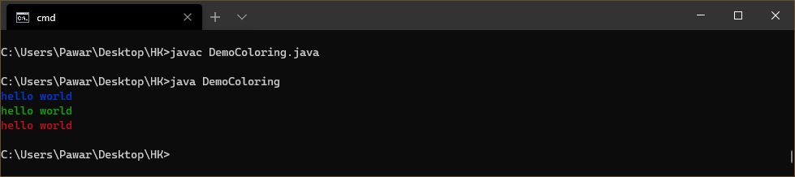

# Java Colored Text Sysout 

> Colorize the command output with this extension 🔥 


- Useful for debugging .✔️ 
- instead of seeing B&W colors you can have rgb colors. 👏

## Features

- Adds RGB color presents 🚩

## Usage 

- use printgreen,printred,printgreen.
- call the method wherever in main.





>  ANSI escape codes for Reference
```java 
public static final String ANSI_RESET = "\u001B[0m";
public static final String ANSI_RED = "\u001B[31m";
public static final String ANSI_GREEN = "\u001B[32m";
public static final String ANSI_YELLOW = "\u001B[33m";
public static final String ANSI_BLUE = "\u001B[34m";
public static final String ANSI_PURPLE = "\u001B[35m";
public static final String ANSI_CYAN = "\u001B[36m";

```

>## More colors are coming

## Release Notes

### 1.0.0

Initial release with three colors only

### 1.0.3

- added 7 colors .
- method signature as static. 
- readme updated.


## **Enjoy!** 👍
