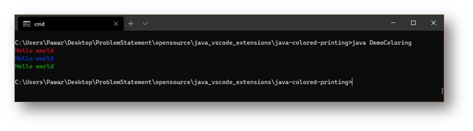
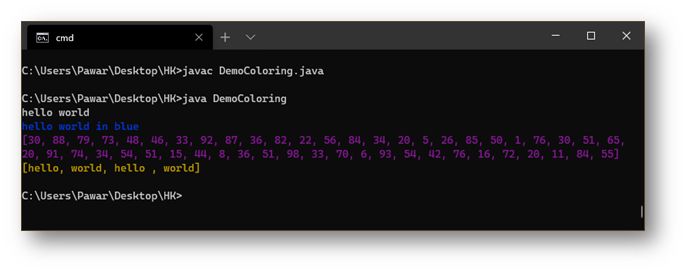
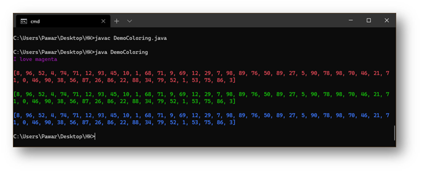

# Java Colored Text Sysout 

> Colorize the command output with this extension 🔥 


- Useful for debugging .✔️ 
- instead of seeing B&W colors you can have rgb colors. 👏

## Features

- Adds RGB color presents 🚩

## Usage 

- use printgreen,printred,printgreen.
- call the method wherever in main.









>  ANSI escape codes for Reference

```java 

 // Reset
    public static final String RESET = "\033[0m";  // Text Reset

    // Regular Colors
    public static final String BLACK = "\033[0;30m";   // BLACK
    public static final String RED = "\033[0;31m";     // RED
    public static final String GREEN = "\033[0;32m";   // GREEN
    public static final String YELLOW = "\033[0;33m";  // YELLOW
    public static final String BLUE = "\033[0;34m";    // BLUE
    public static final String PURPLE = "\033[0;35m";  // PURPLE
    public static final String CYAN = "\033[0;36m";    // CYAN
    public static final String WHITE = "\033[0;37m";   // WHITE

    // Bold
    public static final String BLACK_BOLD = "\033[1;30m";  // BLACK
    public static final String RED_BOLD = "\033[1;31m";    // RED
    public static final String GREEN_BOLD = "\033[1;32m";  // GREEN
    public static final String YELLOW_BOLD = "\033[1;33m"; // YELLOW
    public static final String BLUE_BOLD = "\033[1;34m";   // BLUE
    public static final String PURPLE_BOLD = "\033[1;35m"; // PURPLE
    public static final String CYAN_BOLD = "\033[1;36m";   // CYAN
    public static final String WHITE_BOLD = "\033[1;37m";  // WHITE

    // Underline
    public static final String BLACK_UNDERLINED = "\033[4;30m";  // BLACK
    public static final String RED_UNDERLINED = "\033[4;31m";    // RED
    public static final String GREEN_UNDERLINED = "\033[4;32m";  // GREEN
    public static final String YELLOW_UNDERLINED = "\033[4;33m"; // YELLOW
    public static final String BLUE_UNDERLINED = "\033[4;34m";   // BLUE
    public static final String PURPLE_UNDERLINED = "\033[4;35m"; // PURPLE
    public static final String CYAN_UNDERLINED = "\033[4;36m";   // CYAN
    public static final String WHITE_UNDERLINED = "\033[4;37m";  // WHITE

    // Background
    public static final String BLACK_BACKGROUND = "\033[40m";  // BLACK
    public static final String RED_BACKGROUND = "\033[41m";    // RED
    public static final String GREEN_BACKGROUND = "\033[42m";  // GREEN
    public static final String YELLOW_BACKGROUND = "\033[43m"; // YELLOW
    public static final String BLUE_BACKGROUND = "\033[44m";   // BLUE
    public static final String PURPLE_BACKGROUND = "\033[45m"; // PURPLE
    public static final String CYAN_BACKGROUND = "\033[46m";   // CYAN
    public static final String WHITE_BACKGROUND = "\033[47m";  // WHITE

    // High Intensity
    public static final String BLACK_BRIGHT = "\033[0;90m";  // BLACK
    public static final String RED_BRIGHT = "\033[0;91m";    // RED
    public static final String GREEN_BRIGHT = "\033[0;92m";  // GREEN
    public static final String YELLOW_BRIGHT = "\033[0;93m"; // YELLOW
    public static final String BLUE_BRIGHT = "\033[0;94m";   // BLUE
    public static final String PURPLE_BRIGHT = "\033[0;95m"; // PURPLE
    public static final String CYAN_BRIGHT = "\033[0;96m";   // CYAN
    public static final String WHITE_BRIGHT = "\033[0;97m";  // WHITE

    // Bold High Intensity
    public static final String BLACK_BOLD_BRIGHT = "\033[1;90m"; // BLACK
    public static final String RED_BOLD_BRIGHT = "\033[1;91m";   // RED
    public static final String GREEN_BOLD_BRIGHT = "\033[1;92m"; // GREEN
    public static final String YELLOW_BOLD_BRIGHT = "\033[1;93m";// YELLOW
    public static final String BLUE_BOLD_BRIGHT = "\033[1;94m";  // BLUE
    public static final String PURPLE_BOLD_BRIGHT = "\033[1;95m";// PURPLE
    public static final String CYAN_BOLD_BRIGHT = "\033[1;96m";  // CYAN
    public static final String WHITE_BOLD_BRIGHT = "\033[1;97m"; // WHITE

    // High Intensity backgrounds
    public static final String BLACK_BACKGROUND_BRIGHT = "\033[0;100m";// BLACK
    public static final String RED_BACKGROUND_BRIGHT = "\033[0;101m";// RED
    public static final String GREEN_BACKGROUND_BRIGHT = "\033[0;102m";// GREEN
    public static final String YELLOW_BACKGROUND_BRIGHT = "\033[0;103m";// YELLOW
    public static final String BLUE_BACKGROUND_BRIGHT = "\033[0;104m";// BLUE
    public static final String PURPLE_BACKGROUND_BRIGHT = "\033[0;105m"; // PURPLE
    public static final String CYAN_BACKGROUND_BRIGHT = "\033[0;106m";  // CYAN
    public static final String WHITE_BACKGROUND_BRIGHT = "\033[0;107m";   // WHITE


```

>## More colors are coming

## Release Notes

### 1.0.0

Initial release with three colors only

### 1.0.3

- added 7 colors .
- method signature as static.
- readme updated.

### 1.0.4

- added 3 bright colors.
- added magenta color.

### 1.0.6

- Bold color fix and readme update

## **Enjoy!** 👍 
_FYI I only use bright colors printblue_bright() is my fav 💙_
